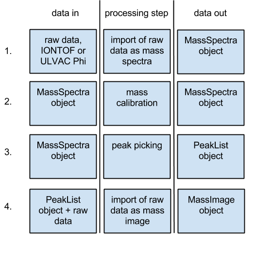

```{r global_options, include=FALSE}
knitr::opts_chunk$set(fig.width=3.5, fig.height=3.5, fig.path='Figs/',
                      echo=TRUE, warning=FALSE, message=FALSE)
```


## Abstract

The `tofsims` package is a toolbox for importing, processing and analysing Time-of-Flight Secondary Ion Mass Spectrometry (ToF-SIMS) data. It currently supports the two most common commercial instrument platforms.

ToF-SIMS is a well established mass spectrometry technique with impressive figures of merit for chemical imaging [@Beluetal2003, @FletcherVickermann2013]. However, due to a number of reasons, ToF-SIMS instruments are not common in life science labs and experiments are therefore usually performed at specialized facilities. The `tofsims` package targets biologists and bioinformaticians who have their samples analyzed by a ToF-SIMS facility and need tools to analyze the obtained rawdata by temselves.

Other R packages availavle for processing and analysis of Imaging Mass Spectrometry (IMS) data are MALDIquant [@MALDIquant] and Caridnal [@Cardinal], however both without support for ToF-SIMS experiments. Outside of R, a non open-source package for Matlab [@NBToolbox] and a commercial toolbox also for Matlab are the few options to the instrument manufacturers tools.  

This vignette showcases a user session using the most common methods available in the `tofsims` package.


## Workflow

### Loading Spectra Data
The `tofsims` package has import functions for both pre-processed binary files of type *BIF/BIF6* and raw data from two popular ToF-SIMS platforms (*ULVAC-Phi*, *IONTOF*). The former are imported directly using the `MassImage()` function with the *select* arguments *ulvacbif* or *iontofbif*. The latter require additional steps as shown in the figure below.


For the following session, an 'ULVAC-Phi' rawdata file is first imported as a spectrum. The binary file is stored in the */rawdata* directory of *tofsimsData* package. The *select* argument of `MassSpectra()` has the options *ulvacraw* and *iontofraw*:

```{r, message=FALSE}
library(tofsims)
library(tofsimsData)

### get path to raw data file
rawData<-system.file('rawdata', 'trift_test_001.RAW', package="tofsimsData")
### the following param will cause to run non parallel
library(BiocParallel)
register(SnowParam(workers=0), default=TRUE)
spectraImport<-MassSpectra(select = 'ulvacraw', analysisName = rawData)
```


`show()` returns a summary of the created MassSpectra object and `plot()` can be used to visualize the imported spectra:

```{r}
show(spectraImport)
plot(spectraImport, mzRange=c(1,150), type='l')
```

### Mass Calibration ###
Functions for mass calibration can be used on-screen or with arguments for batch processing of multiple files. If no *value* argument is provided, the user is prompted in the plot window.
```{r, message=FALSE}
spectraImport <- calibPointNew(object = spectraImport, mz = 15, value = 15.0113)
spectraImport <- calibPointNew(object = spectraImport, mz = 181, value = 181.0444)
spectraImport <- recalibrate(spectraImport)
```

### Creating a Peaklist

`unitMassPeaks()`is used to construct a peaklist for image import. Functions for more advanced peak picking are described in the package and upcoming vignettes. However, for image data with low spectral resolution, unit mass resolution is often sufficient. When the `lower` and/or `upper` argument are/is left out, peak width at the chosen M/z's (`widthAt`) is chosen on-screen. The `factor` argument allows choosing assymetric peak widths. Peak widths are interpolated linear between the two *M/z* chosen in `widthAt`.
```{r, tidy=FALSE, message=FALSE}

spectraImport <- unitMassPeaks(object = spectraImport, 
              mzRange = c(1,250), 
              widthAt = c(15,181), 
              factor = c(0.4, 0.6),
              lower = c(14.96283,15.05096), 
              upper = c(180.80902,181.43538))

plot(spectraImport, mzRange=c(35,45), type='l')
```

### Importing/Loading Image Data
Now, the experiment can be imported with the peak list as image data followed by poisson scaling. Poisson scaling is commonly used on ToF-SIMS data [@KeenanKotula2004]. Visualization of image data is by the `image()` function. 
```{r}
library(RColorBrewer)
imageImport<-MassImage(select = 'ulvacrawpeaks', 
                       analysisName = rawData, 
                       PeakListobj = spectraImport)
imageImport <- poissonScaling(imageImport)
image(imageImport, col=brewer.pal(9, 'PuRd'))
```

### Multivariate Image Analysis
Various multivariate analysis methods are implemented. Here, Principal Component Analysis (PCA) [@Woldetal1987] and Maximum Autocorrelation Factors (MAF) [@SwitzerGreen1984] are shown. While PCA is used for dimension reduction in a wide range of applications, MAF is specifc for spatial datasets. Its usefulness has been demonstrated for ToF-SIMS imaging datasets [@Hendersonetal2009]. Other methods available in the *tofsims* package are Multivariate Curve Resolution (MCR) [@JaumontTauler2015] and Minimum Noise Fraction (MNF) [@Stoneetal2012].

```{r, fig.width=7, fig.height=2, results="hide"}
imageImport <- PCAnalysis(imageImport, nComp = 4)
imageImport <- MAF(imageImport, nComp = 4)
par(mar=c(0,0,0,0), oma=c(0,0,0,0), mfrow=c(2,4))
for(iii in 1:4) image(analysis(imageImport, 1), comp=iii)
for(iii in 1:4) image(analysis(imageImport, 2), comp=iii)
```

### Image Analysis
The `EBImage` package from Bioconductor [@Pauetal2010] can be used for segmentation of ToF-SIMS image data. A typical workflow is to choose a principal component that contains chemical features of interest and convert it by threshholding into a black and white mask.


```{r, fig.width=3.5, fig.height=3.5}
library(EBImage)
pcaScore3<-imageMatrix(analysis(imageImport, 1), comp=3)
pcaScore3Mask<-thresh(x = pcaScore3, h = 30, w = 30)
par(mar=c(0,0,0,0), oma=c(0,0,0,0))
image(pcaScore3Mask, col=c('white', 'black'))
```

The mask can be used directly for area quantitations.
```{r}
paste(round(100/(xy(imageImport)[1]*xy(imageImport)[2])*sum(pcaScore3Mask),2), 
      ' % of the image is Cell Wall')
```


The mask can also be modified by the tools available in `EBImage`. Below the morphology operations 'opening' and 'closing' are shown.
```{r, fig.width=7, fig.height=3.5}
opened<-opening(pcaScore3Mask, kern = makeBrush(3, shape = 'diamond'))
closed<-closing(pcaScore3Mask, kern = makeBrush(3, shape = 'diamond'))
par(mar=c(0,0,0,0), oma=c(0,0,0,0), mfcol=c(1,2))
image(opened, col = c('white', 'black'))
image(closed, col = c('white','black'))
```

Masks can then be applied back to the original image to select and visualize specific compound mass spectra. In the example below the 'opened' mask is applied on the original imported image. This operation removes all signal from the area which was shown white in the mask. Multiple masks, for example from different PCA components can as such be used for image segmentation. 

```{r, fig.width=7, fig.height=3.5}
cellWall<-bwApply(imageImport,(opened-1)^2)
par(mar=c(0,0,0,0), oma=c(0,0,0,0), mfcol=c(1,2))
image(cellWall,col=brewer.pal(9, 'PuRd'))
image(imageImport,col=brewer.pal(9, 'PuRd'))
```


## References